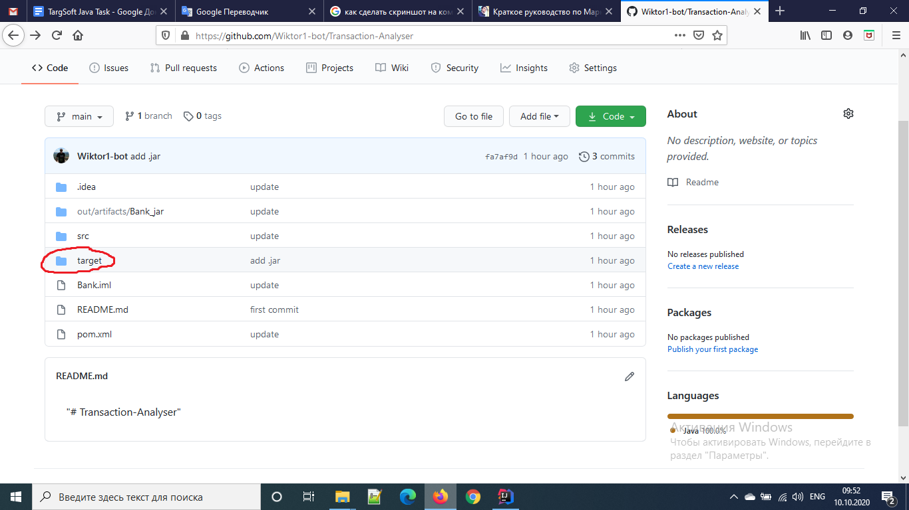
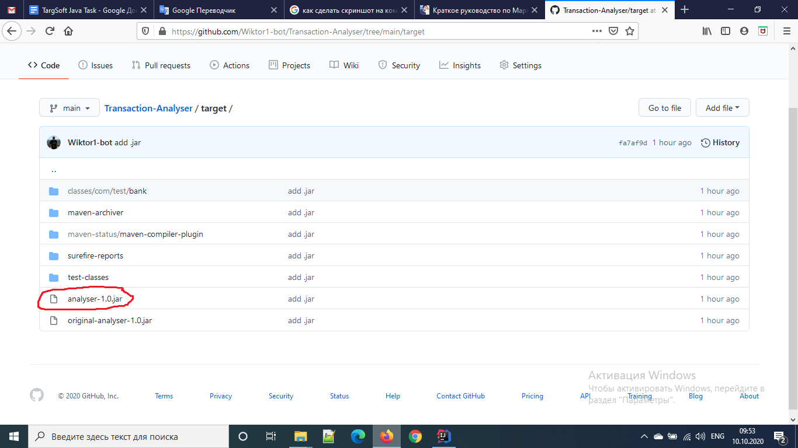
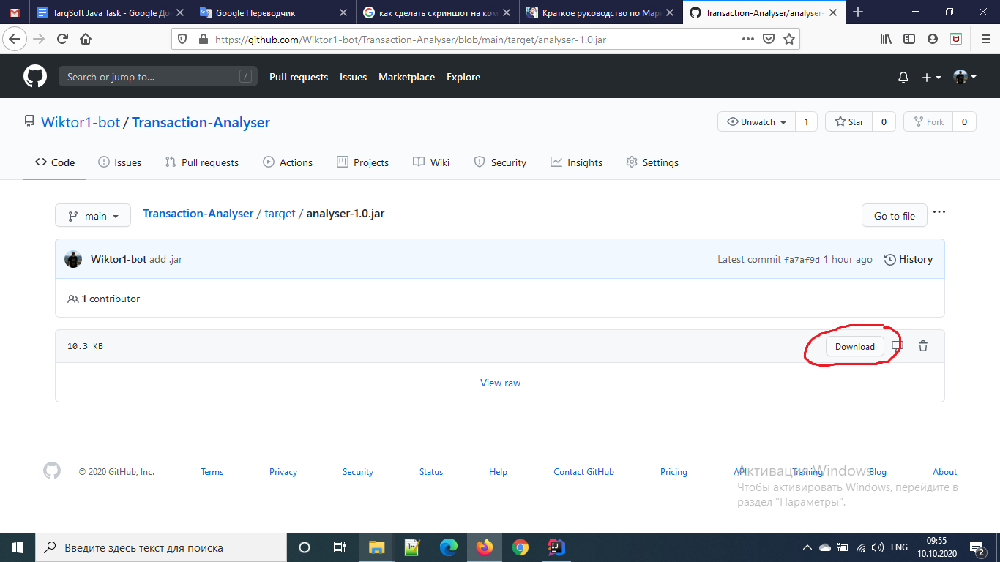
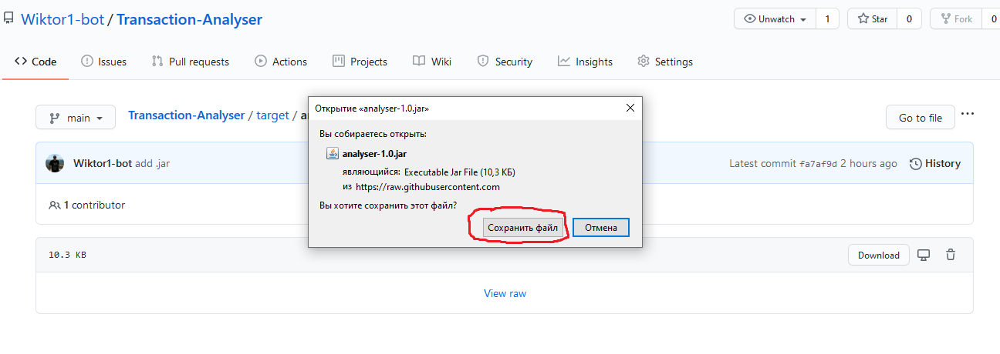
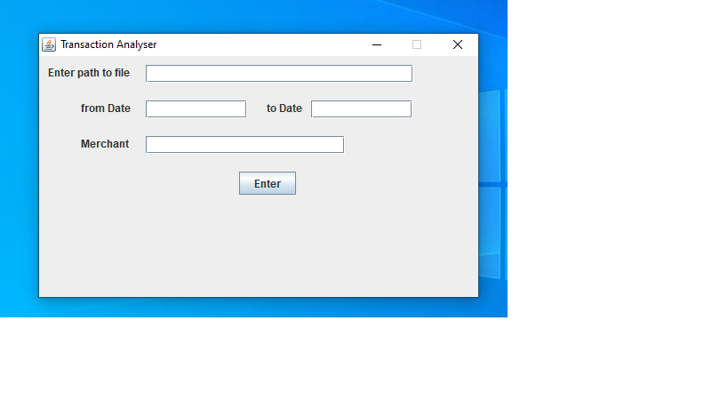

## Transaction-Analyser

**The program is designed for a simplified analysis of financial transactions with files in the CSV format.**

##### Quick Start Guide:
1. **Open the directory:** _target_

2. **Open the file:** _analyser-1.0.jar_

3. **Download file** _analyser-1.0.jar_

4. **In the window that appears, click save.**

5. **Select the saved file and run it.
   A window should appear:**
   "# Transaction-Analyser" 
